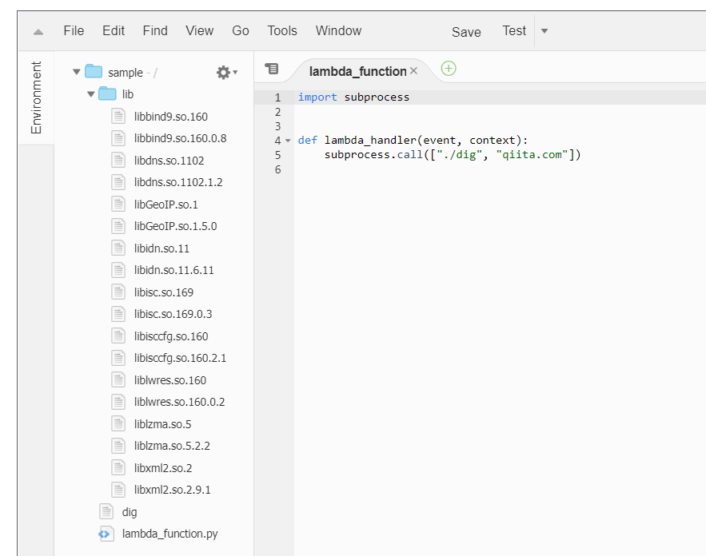
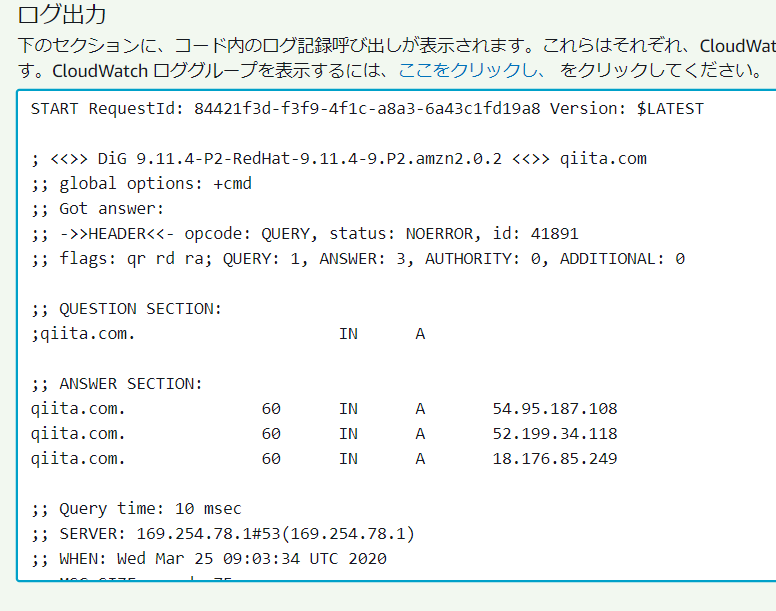

# AWS Lambda で実行できるコマンドを作成する環境を作ってみた

いったい何の役に立つねんシリーズ。技術の無駄遣い担当の平野です。いや、今回の役に立つはず。

AWS Lambda で Python や Node のスクリプトを書いていると、「あー、この Linux コマンド使えたら便利なのに」と思うときが時々あります。

ということで、Lambda 用に簡単にコマンドを作成、取り出しできる Docker コンテナを作ってみました。

github:
https://github.com/qualitiaco/build-pack

dockerhub:
https://hub.docker.com/r/qualitiaco/lambda-build-pack

今回は、これの解説と使い方を説明したいと思います。

## AWS Lambda の実行環境

AWS Lambda で動作しているのと同様の Docker Image が AWS から公開されています。

github:
https://github.com/lambci/docker-lambda

dockerhub:
https://hub.docker.com/u/lambci

今回は、この dockerhub にある、lambci/lambda-base-2 を使ってビルドしてみました。

## Build 環境と実行環境

lambci/lambda-base-2 のコンテナイメージには、latest タグと、build タグが存在します。
latest の方が、実際の runtime 環境のベースになるもののようで、lambda-base-2:latest に対して Python や NodeJS の環境が追加された物が lambda の実行環境になる、というようなイメージです。
実際、こちらには yum も gcc も実行時に必要なさそうなものは入っていません。
本物の AWS Lambda では Python や Node が必要とするライブラリも入っていますので、完全に同じというわけではありません。

一方、biuld タグの方は、yum や git など開発に必要なものがいくつかインストールされています。

## AWS Lambda で動作するバイナリーファイルとライブラリを取り出し方法

基本的には lambda-base-2:build の環境上でコンパイルしてできたバイナリーファイルを AWS Lambda に持って行って動かせばいいのですが、実行ファイルだけを持って行っても、必要なライブラリが Lambda 環境にない場合があります。
リンクされているものを全部持って行くと、これも大げさで、あまり現実的ではありません。

そこで、lambda-base-2:build で作成した実行ファイルを lambda-base-2:latest の環境で検証し、足りないライブラリのみを抽出することで、AWS Lambda 上で必要十分なライブラリを用意することにしました。
Python が必要とするライプラリ等、多少重複する物もありますが、今回はどの Lambda でも動作する物を目指します。
どうしても小さくしたければ、lambci には Python 用のイメージ等もありますので、Dockerfile を変更することで簡単に実現できると思います。

## 環境の作成

Docker の stage build を使って、lambda-base-2:latest の/usr/lib64 以下を lambda-base-2:build の/lib64.runtime に保存し、比較できるようにしました。

詳細な動作は、ソースをご覧ください。
https://github.com/qualitiaco/build-pack

## AWS Lambda で動作するバイナリファイルとライブラリの取り出し

作成した Docker イメージを使用してみます。

今回は、シンプルだけどシンプルじゃなさそうな、dig コマンドを AWS Lambda で実行してみたいと思います。

### 必要なコマンドの取り出すスクリプト作成

まず、以下のような Shell Script を src/build.sh として作成します。

- AWS Lambda で実行したいコマンドを yum で作成するか、または、コンパイルします
- コマンドを\${OUTPUT_PATH}にコピーします

```sh:src/build.sh
#!/bin/sh

OUTPUT_PATH=${OUTPUT_PATH:-output}

yum install -y bind-utils
cp -a /usr/bin/dig ${OUTPUT_PATH}
```

### コマンドとライブラリの取り出し

docker を実行して、コマンドとライブラリを取り出します。

```console
docker run -v $(pwd)/output:/output -v $(pwd)/src:/src -it --rm qualitiaco/lambda-build-pack
```

### 取り出したライブラリの確認

dig コマンドと、必要そうなライブラリが抽出されました。

```
.
|-- output
|   |-- dig
|   `-- lib
|       |-- libGeoIP.so.1 -> libGeoIP.so.1.5.0
|       |-- libGeoIP.so.1.5.0
|       |-- libbind9.so.160 -> libbind9.so.160.0.8
|       |-- libbind9.so.160.0.8
|       |-- libdns.so.1102 -> libdns.so.1102.1.2
|       |-- libdns.so.1102.1.2
|       |-- libidn.so.11 -> libidn.so.11.6.11
|       |-- libidn.so.11.6.11
|       |-- libisc.so.169 -> libisc.so.169.0.3
|       |-- libisc.so.169.0.3
|       |-- libisccfg.so.160 -> libisccfg.so.160.2.1
|       |-- libisccfg.so.160.2.1
|       |-- liblwres.so.160 -> liblwres.so.160.0.2
|       |-- liblwres.so.160.0.2
|       |-- liblzma.so.5 -> liblzma.so.5.2.2
|       |-- liblzma.so.5.2.2
|       |-- libxml2.so.2 -> libxml2.so.2.9.1
|       `-- libxml2.so.2.9.1
`-- src
    `-- build.sh
```

### AWS Lambda で動かすコマンドの作成

今回は output/lambda_function.py として output の中に直接作成します。

```python:output/lambda_function.py
import subprocess


def lambda_handler(event, context):
    subprocess.call(["./dig", "qiita.com"])
```

qiita.com の DNS を引くだけのシンプルなプログラムです。
直下の lib/の下は気にしなくても参照されるようで、LD_LIBRARY_PATH 等の設定も必要ありませんでした。
もし、動作しなければ、そこを疑ってください。

### zip で固める

lambda にアップロードするために、zip で固めます。
シンボリックリンクを含みますので、「-y」オプションを付けるのを忘れないでください。

```console
cd output
zip -9yr ../output.zip *
```

### lambda にアップロードして確認

あらかじめ Python 用の Lambda 関数を作成してからアップロードします。

いい感じです。



実行してみます。



ちゃんと、動作しているようです。

## おわりに

今回わけあって作成して公開した Docker イメージ、qualitiaco/lambda-build-pack の紹介をしました。
応用した楽しいアイデアがあれば、ぜひお知らせください。
PullReq や間違いの指摘などもお待ちしております。
