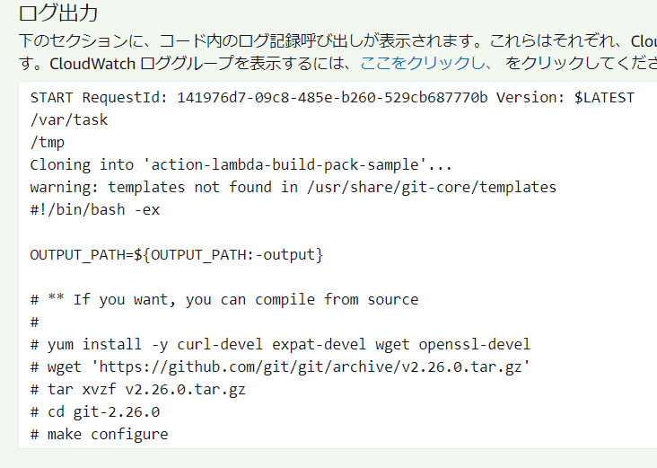

# AWS Lambdaでgitコマンドを使う

AWS Lambdaでgitコマンドを使いたい場合があります。
githubのAPIを呼んだり、dulwichを使ってもいいのですが、新しく勉強するよりは、できれば、いつもの使い慣れたgitコマンドを使いたいものです。

### 使う物

AWS Lambda用にコマンドとライブラリをいい感じにまとめてくれるDockerコンテナ
→ https://hub.docker.com/r/qualitiaco/lambda-build-pack

## gitコマンドとライブラリを抽出

### gitコマンドを取り出すスクリプト

```sh:src/build.sh
#!/bin/sh

yum install -y git
cp -a /usr/bin/git ${OUTPUT_PATH}
cp -a /usr/libexec/git-core/git-remote-https ${OUTPUT_PATH}
cp -a /usr/libexec/git-core/git-remote-http ${OUTPUT_PATH}
```

yum でgitをインストールし(もしかしたら既に入っているかもしれませんが)、gitコマンド実行に必要な/usr/bin/gitとhttps通信に必要な、/usr/lib/exec/git-code/git-remote-http(s) を${OUTPUT_PATH}ディレクトリにコピーします。

この後のdockerコマンドが、${OUTPUT_PATH}にあるコマンドに必要なライブラリを自動的に抽出してくれます。

今回はyumで入れましたが、最新がよければ、gitこまんどをbuild.shスクリプト内でコンパイルしても構いません。

### AWS Lambda環境用のgitコマンドとライブラリの取り出し

```console
docker run -it --rm -v $(pwd)/src:/src -v $(pwd)/output:/output qualitiaco/lambda-build-pack
```

## AWS Lambdaにアップロードする

### Lambda Functionの作成

今回はPythonで作成してみます。
さっきできたoutputディレクトリの中に作成します。

```python:output/lambda_function.py
import subprocess
import os


def lambda_handler(event, context):
    cwd = os.getcwd()
    os.chdir("/tmp")

    subprocess.call([
        os.path.join(cwd, "git"),
        f"--exec-path={cwd}",
        "clone",
        "https://github.com/qualitiaco/action-lambda-build-pack-sample.git"])

    print(open("/tmp/action-lambda-build-pack-sample/src/build.sh", "r").read())
```

githubのhttps://github.com/qualitiaco/action-lambda-build-pack-sample.git からgit cloneして、その中にあるsrc/build.shを出力するだけのプログラムです。

### zipする

outputディレクトリの中から圧縮します。
シンボリックリンクを含みますので、「-y」オプションを忘れないよう付けてください。

```console
cd output
zip -9yr ../lambda_function.zip *
```

## 確認

AWS Lambda Functionをあらかじめ作成してzipファイルをアップロードします。
少しサイズが大きいので、関数のソースコードをWebで確認することはできません。

実行すると、



githubからgit cloneして取得したソースコードが表示されました。

## 終わりに

Dockerコンテナqualitiaco/lambda-build-packを使用してAWS Lambdaに必要なgitコマンドとライブラリを取得し、AWS Lambdaでgitコマンドを実行してみました。

本記事で使用したソースコードは、
https://github.com/qualitiaco/action-lambda-build-pack
にも置いてありますので、併せてご覧ください。
