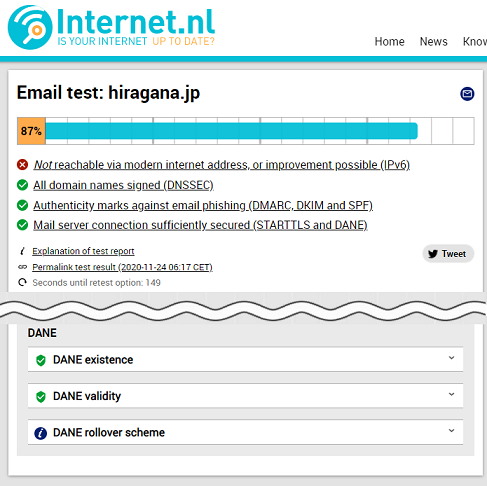

# DANEのススメ

## DANEとは

DANEとは、MTA-STS同様にメールの配送経路上のメールサーバーとメールサーバーの間の暗号化の仕組みを少し強くするためのものです。

受信側が宣言することで、送信サーバーに対して、

- STARTTLSを必ず使う
- TLS1.0以上、できれば1.2以上を必ず使う
- DNSSECが検証できなければ配送しない
- 公開鍵が正しくない場合は配送しない

ようにしてもらうことを、お願いする仕組みです。

MTA-STSとの違いは、送信先が正しいということの検証を、証明書のトラストチェーンでおこなうのではなく、DNSSECのトラストチェーンと公開鍵や証明書をDNSの値と比較することで正当性の検証をおこなうというところです。

## 設定方法

### DNSSECの有効

DANEが有効になるためには、DNSSECが有効になっている必要があります。
DNSSECは自分で管理するには敷居が高いので、今回の検証では、[QUALITIA DNS QT-DNS(仮)](https://qt-dns.com)を使用しました。


### TLSAレコードの設定

DNSにTLSの公開鍵(のハッシュ)を**受信メールサーバー毎に**設定します。
他のメールセキュリティの設定とは異なり、TLSAという専用のレコードとして記述します。
また、記述する際のホスト名はメールアドレスのドメインパートではなく、受信メールサーバーのホスト名を使用します。

#### 設定例

例えば、受信メールサーバーがmail1.example.jpの場合、次のように記述します。

```DNS
_25._tcp.mail1.example.jp.    IN    TLSA    3 1 1 293F3944E435835EC797ACBBE52FFB1BC8E6637879FBE62D9B6195479E01F67E
```

3 1 1 の部分の最初の3 1は自分のTLSの公開鍵について記述する場合はお決まりだという程度の認識で大丈夫です。
最後の1はTLSの公開鍵のハッシュ方式を指定しています。0, 1, 2があり、それぞれ、

**0**. ハッシュしない
**1**. SHA256でハッシュする
**2**. SHA512にハッシュする

を表します。
「ハッシュしない」はあまり使われないので、SHA256を使用したい場合は3 1 1、SHA512を使用する場合は3 1 2となります。

#### ハッシュの計算方法

TLSで使用している証明書ファイルcert.pemから公開鍵のハッシュを取り出すには次のようにします。

```sh
openssl x509 -in cert.pem -pubkey -noout \
| openssl rsa -pubin -outform DER \
| openssl sha256
```

少し回りくどいことをしているように見えますが、TLSAレコードに記述するハッシュは、PEM形式の公開鍵ではなく、正味の公開鍵本体部分についてのハッシュなので、このように一旦DER形式に変換した後ハッシュを取得しています。

はじめてTLSAレコードを作成する場合であれば、次のようにメールサーバーにある証明書をopensslコマンドで取得して計算しても構いません。

```sh
openssl s_client -connect mail1.example.jp:25 -starttls smtp < /dev/ull \
| openssl x509 -pubkey –noout \
| openssl rsa -pubin -outform DER \
| openssl sha256
```

ただし、更新時には、TLSの鍵交換より先に、交換する予定の鍵のTLSAレコードの公開を行う必要がありますので、事実上この方法は使えません。

## 設定内容の検証

DNSSEC, TLSAレコードの設定をし、オランダ政府御用達のinternet.nlで検証してみました。



バッチリです。

## DANEレポートについて

DANEについてもMTA-STSのようにレポートが来る仕様なのですが、残念ながらまだ本物を手に入れられていません。
手に入ったらまた記事にしたいと思います。

## なぜSTARTTLS + MTA-STSだけだと不十分なのか

なぜ、STARTTLSだけでは不十分なのかについてはMTA-STSのススメの方に書きましたので、そちらをご参照ください。

[なぜSTARTTLSだけだと不十分なのか](https://qiita.com/hirachan/items/d0028da3ebb80b138404#%E3%81%AA%E3%81%9Cstarttls%E3%81%A0%E3%81%91%E3%81%A0%E3%81%A8%E4%B8%8D%E5%8D%81%E5%88%86%E3%81%AA%E3%81%AE%E3%81%8B)

上記にも、記述がありますが、MTA-STSでもDNSのキャッシュポイズニング等でDNSのレコード自体を詐称された場合にはSTARTTLSを無効化される場合があります。
これについては、DANEではDNSSECを必須とすることで回避しています。

また、MTA-STSは証明書のトラストチェーンを信頼していますので、Root CAまでたどれるような偽の証明書の場合、偽物かどうかの区別はできず、悪意のある中間者はメールを詐取可能です。
これについても、DANEではDNSSECのトラストチェーンを検証することで、また、公開鍵が本物かどうかを検証することで回避しています。


## DANEでも守れないこと

DANEはDNSSECに大きく依存しています。
DNSSECが正しく運用できていない場合や、DNSSECに起因する脆弱性には弱いと言えます。

## おわりに

すでに、メール受信サーバーがTLSに対応しているのであれば、ぜひ、DNSSECを運用してTLSAレコードを宣言してみてください。
ただし、TLSの鍵交換のタイミングでTLSAをロールオーバーすることをお忘れなく。

## 参考資料

[RFC6698 The DNS-Based Authentication of Named Entities (DANE) Transport Layer Security (TLS) Protocol: TLS](https://tools.ietf.org/html/rfc6698)
[RFC7671 The DNS-Based Authentication of Named Entities (DANE) Protocol: Updates and Operational Guidance](https://tools.ietf.org/html/rfc7671)
[RFC7672 SMTP Security via Opportunistic DNS-Based Authentication of Named Entities (DANE) Transport Layer Security (TLS)](https://tools.ietf.org/html/rfc7672)
[MTA-STSのススメ](https://qiita.com/hirachan/items/d0028da3ebb80b138404)
[送信ドメイン認証・暗号化 Deep Dive!](https://speakerdeck.com/hirachan/song-xin-domeinren-zheng-an-hao-hua-deep-dive) (自分の発表資料ですが・・・)
