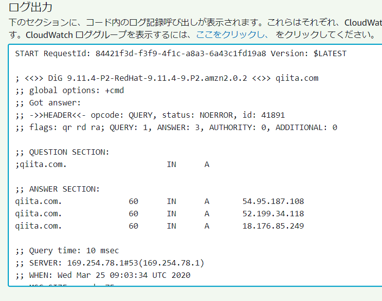

# Github ActionsでAWS Lambda用のコマンドをBuildする

AWS Lambda で Python や Node のスクリプトを書いていると、「あー、この Linux コマンド使えたら便利なのに」と思うときが時々あります。

そういうときに、便利なBuild用Dockerコンテナを先日作成しました。

→ [AWS Lambda で実行できるコマンドを作成する環境を作ってみた](https://qiita.com/qualitia_cdev/items/4aebb1e22be9afab0a16)

今回は、これをgithub actionsにして公開してみたので、その使い方をご紹介します。

https://github.com/marketplace/actions/aws-lambda-build-and-pack

## Buildスクリプトの作成

今回もAWS Lambda上でdigコマンドを動かしてみたいと思います。

### デフォルトのディレクトリ構造

```
.
|-- src
|   `-- build.sh
|-- output
`-- .github
   `-- workflows
     `-- build.yaml
```

srcディレクトリに下に、ビルドスクリプト、build.shを配置し、Github Actionsを呼び出すと、outputの下にコマンドと必要なライブラリが出力されます。

### 必要なコマンドの取り出すスクリプト作成

build.shは${OUTPUT_PATH}ディレクトリに必要なコマンドを出力するように書きます。
今回は以下のような Shell Script を src/build.sh として作成します。

- AWS Lambda で実行したいコマンドを yum で取得するか、または、コンパイルします
- コマンドを\${OUTPUT_PATH}にコピーします

```sh:src/build.sh
#!/bin/sh

OUTPUT_PATH=${OUTPUT_PATH:-output}

yum install -y bind-utils
cp -a /usr/bin/dig ${OUTPUT_PATH}
```

yumでdigコマンドをインストールして、${OUTPUT_PATH}にコピーするだけのシンプルなスクリプトです。
ここで、ソースをダウンロードしてコンパイルしても構いません。

## コマンドを呼び出すAWS Lambda Function

今回もPythonで書いてみます。
py/lambda_function.pyとして作成し、Github Actionsでoutputにできあがったものと合わせてzipすることにします。

Python実行時のディレクトリにdigコマンドが存在するようになります。

```python:py/lambda_function.py
import subprocess


def lambda_handler(event, context):
    subprocess.call(["./dig", "qiita.com"])
```

## Github ActionsのWorkflowを作成

Github ActionsのWorkflowを作成します。

```yaml:.github/workflows/build.yaml
name: Sample

on:
  push:
    paths:
        - ".github/workflows/build.yaml"
        - "src/**"
        - "py/**"

jobs:
  build:
    runs-on: ubuntu-latest

    steps:
    - name: Checkout
      uses: actions/checkout@v2

    - uses: qualitiaco/action-lambda-build-pack@v1
      with:
        src-path: src
        build-sh: build.sh
        output-path: output

    - run: |
        cp -a output/* py/
        cd py
        zip -9yr ../deploy.zip *


    - このあと、できあがったdeploy.zipをlambdaにdeployしたり、
    - S3に保存したりするactionを記述します。
```

withの中身はすべてデフォルト値なので、省略可能です。

これで、githubにpushしたら、build.shがAWS Lambdaのbuild環境で実行され、Pythonスクリプトと合わせてdeploy.zipにパッケージされます。

この後は、いつものように、appleboy/lambda-actionを使って直接AWS Lambdaにdeployしたり、S3にアップロードしてdeployしたりしてください。

### AWS LambdaにDeployする

[appleboy/lambda-action](https://github.com/marketplace/actions/aws-lambda-deploy)を使ってAWS Lambdaにdeployしてみます。

```yaml:.github/workflows/build.yaml続き
    - name: AWS Lambda Deploy
      uses: appleboy/lambda-action@v0.0.2
      with:
        aws_access_key_id: ${{ secrets.AWS_ACCESS_KEY_ID }}
        aws_secret_access_key: ${{ secrets.AWS_SECRET_ACCESS_KEY }}
        aws_region: ${{ secrets.AWS_REGION }}
        function_name: sample
        zip_file: deploy.zip
        # dry_run: true
```

このようなworkflowを先ほどのbuild.yamlの続きに記述し、AWS_ACCESS_KEY_ID、AWS_SECRET_ACCESS_KEY、AWS_REGIONをgithubのSecretsに追加します。

次に、AWSでsampleという名前でPython用のLambda Functionを作成し、githubに変更をpushすることで、lambdaにdeployされます。

## 確認

いい感じです。


実行してみます。



ちゃんと、動作しているようです。

## おわりに

AWS Lambdaで動作するコマンドを簡単に作成するGithub Actionsを作ってみたので、その使い方を紹介しました。

今回作成したものとは少しだけ内容が異なりますが、digコマンドの代わりにgitコマンドを実行するサンプルをgitに置いてありますので、参考にしてみてください。

https://github.com/qualitiaco/action-lambda-build-pack-sample
