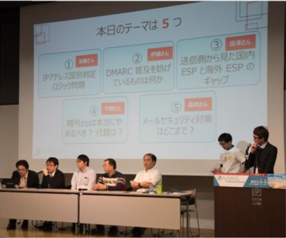

# 暗号化zipやめるべき? 代替方法について

2019年11月 [JPAAWG](https://www.jpaawg.org)の第2回General MeetingのOpen Round Tableで「暗号化zipやめるべき? 代替方法について」というタイトルで議論が行われました。
この時、ファシリテーターをやらせていただきました。
PPAPの代替が話題になっていますので、もったいないので公開しておきます。

内容については、個人の見解ではなく、あくまでこの時集まった方々の意見の集大成となります。

Round Tableへの参加者は20～30人程で、活発な意見交換が行われました。

Open Round Tableの各テーマ毎のまとめ発表の様子です。

## はじめに

当ラウンドテーブルではテーマを暗号化 zip に絞り、パスワードの受け渡し方法についてはスコープ外としました。

その上で、まず、暗号化 zip が存在しない世界において、暗号化 zip があると何がうれしいのかについて議論をおこないました。

## 暗号化 zip で実現できること

- 特定の人だけが見ることができる
- 受信者に安心感
- 送信者に安心感
- 会社の規定に準拠できる
  - ISMS でやれと言われている
  - お客様からの指示
- 圧縮できる
- 転送時にも安心
- 間違って Virus Scan で止められない
- CRC があるので改ざんされない
- アーカイブされるので便利

次に、すべての添付ファイルが暗号化 zip になっている世界において、暗号化 zip がなくなれば何がうれしいのかについて議論をおこないました。

## 暗号化 zip しなければ実現できること

- 添付ファイルのインデックスを作成できる
- ゲートウェイでウィルスチェックができる ← 安心感
- 業務の効率化になる
- メールの通数が減る
  - PPAP のパスワードが来ないので
- 外国へ送るときのめんどくさい説明がなくなる
- パスワードをなくして開けなくなるようにことがおきない

次に、上記の、暗号化 zip でできること、暗号化 zip しないことによってできること、のそれぞれの項目でユーザが実現したい本質的な要求を探りました。

## 上記のようなことをやりたい動機

- 機密な情報の流出を防ぎたい
- 個人情報を見せたくない
- 他の人に見られることで損害を被らないようにしたい
- 誤送信防止のため
- メールが手元から離れた後にどうなるか分からない不安だから
  - 出してしまったメールは取り返せないので
- 大きなサイズのファイルを小さくしたい
- フォルダ構造を表現したい
- メールロストを防ぎたい
- 添付ファイル数が多いとメーラーから取り出すのがめんどくさい
- 業務を効率化したい
  - 検索など
- 安心・安全のため
- スパマーの抜け道を防ぎたい
- 受信者が悪いファイルを開いたときに自分の責任になるのを避けたい
- 会社の信頼が落ちないようにしたい
- パスワードでわざわざ開く時間がもったいない

これらは、暗号化 zip で実現したいことと、ZIP 暗号化しないことで実現したいことの両方が混在しているので、つまり、上記が本当は実現したいことと考えられます。

キーワードは、**安心感**。

    人は、安心感のために、zip 暗号化をし、
    また、安心感のために、zip 暗号化をしない。

ここまで議論した時点で、1 人を除いてほぼ全員が暗号化 zip に対して反対派でした。

そこで、現状の暗号化 zip に対して、何が実現できれば賛成派になれるかについて議論しました。この結論が代替手段になるはずです。

## zip 暗号化の代替手段に必要なもの

- 暗号化は必要
- パスワードを使わなくてよい
- zip より強度の高い暗号化
- シームレスな複合化
- ウィルススキャンが動作する
- 本当に渡したい人にだけ渡ったという確証が欲しい

最終的に、当ラウンドテーブル参加者の暗号化zi 反対派を含む全員が、この代替手段には賛成するということが確認できました。
