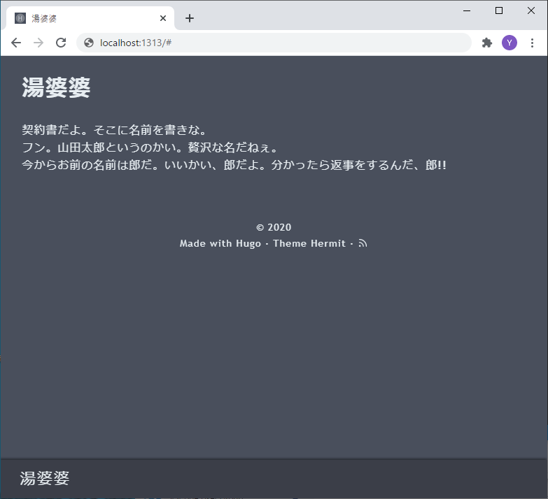
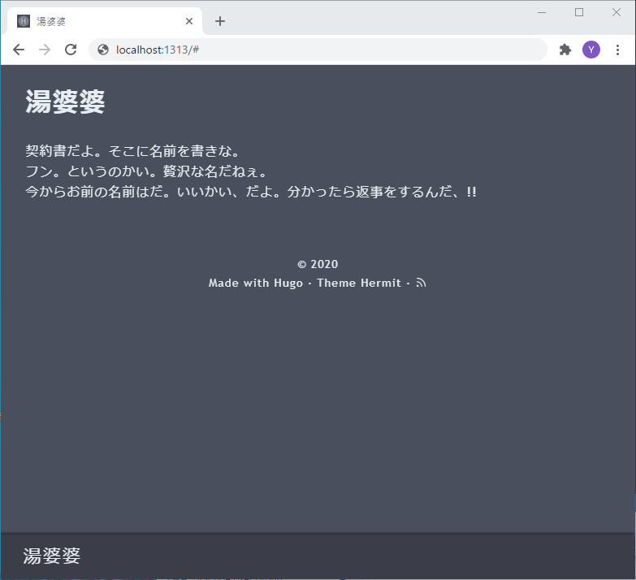
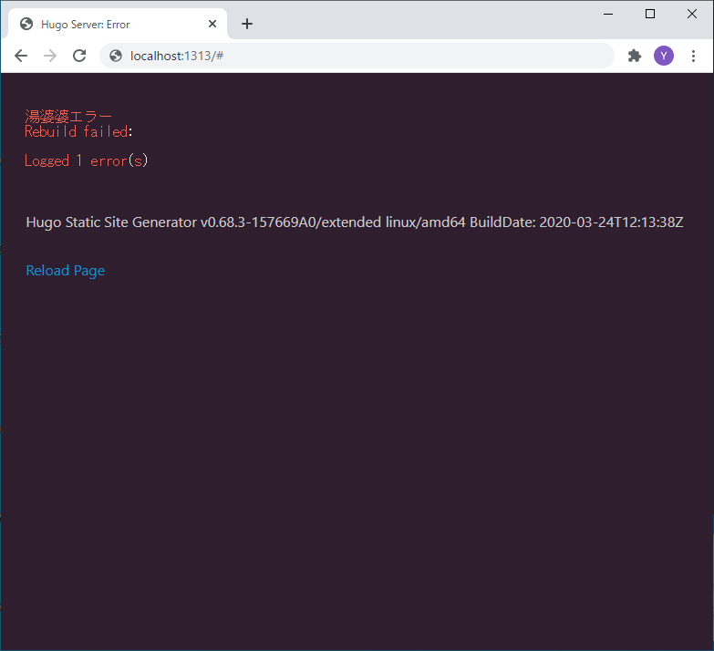

# hugoのshortcodesで湯婆婆

## はじめに

だいぶ乗り遅れた感はあるのですが、hugoのshortcodesでやってる人はみつからなかったので、チャレンジです。

## 下準備

新しいサイトを作成します。

```console
$ hugo new site yuba-ba
```

適当なテンプレートをダウンロードします。
今日はhermitを使うことにします。

```console
$ cd yuba-ba
$ git clone https://github.com/Track3/hermit.git themes/hermit
```

config.tomlも書き換えます。

```toml:config.toml
baseURL = "http://example.org/"
languageCode = "ja-jp"
title = "湯婆婆"
theme = "hermit"
```

## コード

layouts/shortcodesの下にyuba-ba.htmlという名前で作ります。

```html:layouts/shortcodes/yuba-ba.html
{{ $name := .Get 0 }}
{{ $new_name := index (split $name "" | shuffle) 0 }}

契約書だよ。そこに名前を書きな。<br />

フン。{{ $name }}というのかい。贅沢な名だねぇ。<br />

今からお前の名前は{{ $new_name }}だ。いいかい、{{ $new_name }}だよ。分かったら返事をするんだ、{{ $new_name }}!!<br />
```

呼び出す方も作成します。

contents/index.mdを作成します。

```md:contents/index.md
---
title: "湯婆婆"
date: 2020-11-26T13:00:00Z
draft: false
---

```

## 実行

```console
$ hugo server --bind=0.0.0.0 -b http://example.org:1313
```

ブラウザでアクセスしてみます。



いい感じです。

## 湯婆婆エラー

```md:contents/index.md
---

```

に変えてみます。



おっと、エラーになりません。
仕切り直しです。

## エラー処理

エラー処理を入れるのは本望ではないのですが、なかなかいいやり方が見つからなかったので妥協します。

```html:layouts/shortcodes/yuba-ba.html
{{ $name := .Get 0 }}
{{ if eq $name nil }}{{errorf "湯婆婆エラー"}}{{end}}
{{ $new_name := index (split $name "" | shuffle) 0 }}

契約書だよ。そこに名前を書きな。<br />

フン。{{ $name }}というのかい。贅沢な名だねぇ。<br />

今からお前の名前は{{ $new_name }}だ。いいかい、{{ $new_name }}だよ。分かったら返事をするんだ、{{ $new_name }}!!<br />
```

## 湯婆婆エラー リベンジ



できました。
