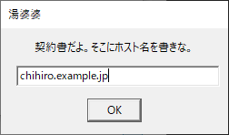
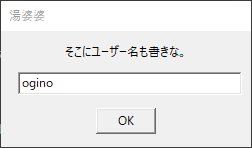
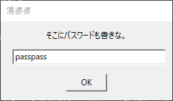
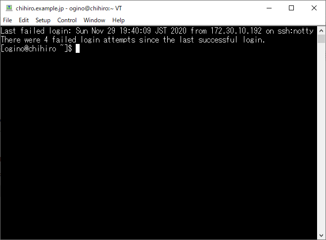
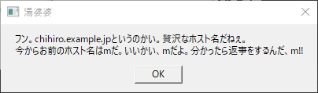
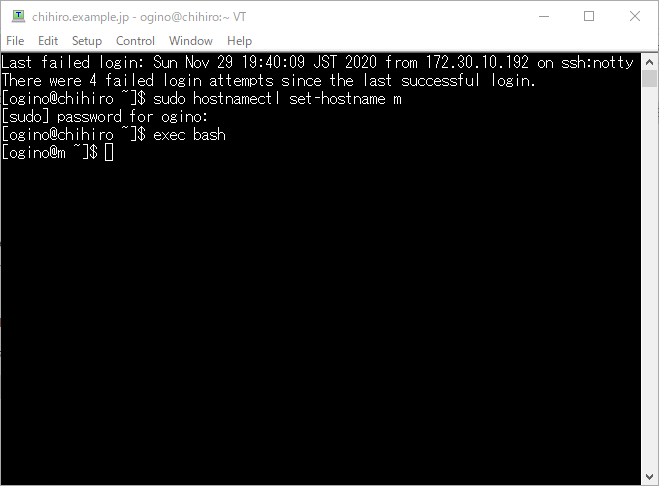
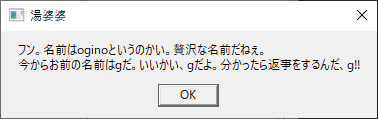
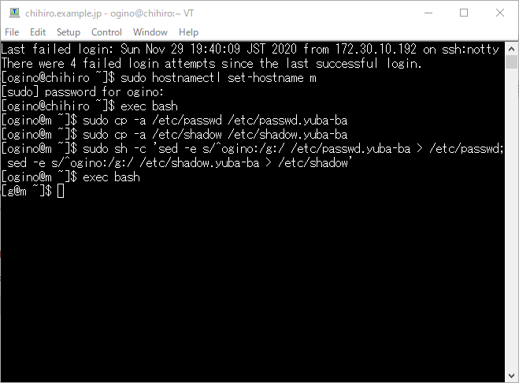
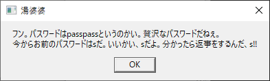
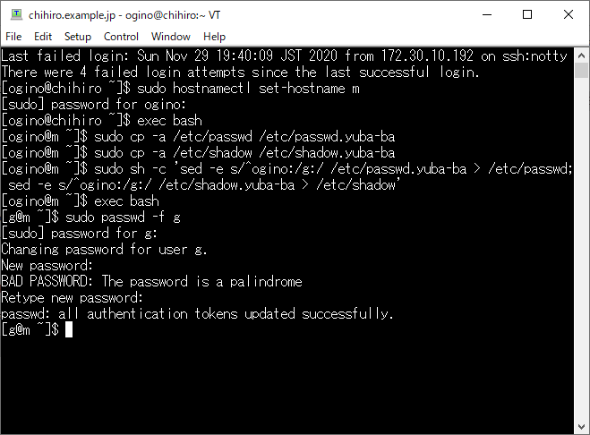

# Tera Term Macroで湯婆婆: ホスト名もユーザー名もパスワードまで実際に変更

## はじめに

Tera TermはWindowsで動作するターミナルソフトのひとつです。
便利なマクロが使えるので、湯婆婆にチャレンジです。

## 下準備

### サーバーの用意

壊れてもいいLinuxサーバーを用意します。
SSHで接続できれば、仮想環境でもコンテナでも大丈夫です。
湯婆婆は何をしでかすかわからないので、壊れては困るサーバーを使用してはいけません。

今回ホスト名は、chihiro.example.jpとします。

### ユーザーの作成

湯婆婆と契約するユーザーを作成します。
ユーザー名はogino、パスワードはpasspassとしておきます。
また、sudoできるように、wheelグループに所属させておきます。

```console
# useradd -G wheel ogino
# passwd ogino
```

## 実行

コードの前に実行結果をお見せしましょう。

契約書に必要なホスト名を求められますので、記述します。



ユーザー名も要求されるので記述します。



パスワードも要求されるので記述します。
丸見えですが、契約書なのであえてそのまま表示しときます。
(もちろん、マスクするコマンドはありますよ！)



ホスト名、ユーザー名、パスワードを入力したので、サーバーにログインされます。



湯婆婆がなにやら言ってきました。
ホスト名が贅沢なので、「m」にされちゃうようです。



ホスト名を「m」にされちゃいました。



今度は、ユーザー名も贅沢なので、「g」にされちゃうようです。



ユーザー名が「g」になっちゃいました。



なんと！パスワードも贅沢なようで、1文字にされちゃいます。
まじですか、湯婆婆さん。
御社のコンプライアンスは大丈夫ですか。



あらら。パスワードまで変えられちゃいました。




## コード

yuba-ba.ttlという名前で保存します。
文字コードはShift-JISです。

```:yuba-ba.ttl
inputbox "契約書だよ。そこにホスト名を書きな。" "湯婆婆"
hostname = inputstr

inputbox "そこにユーザー名も書きな。" "湯婆婆"
username = inputstr

inputbox "そこにパスワードも書きな。" "湯婆婆"
password = inputstr

; サーバーに接続
sprintf2 cmd "%s /ssh /2 /auth=password /user=%s /passwd=%s" hostname username password
connect cmd

; 贅沢なホスト名の変更
wait "$"
strlen hostname
hostname_len = result
do
    random pos hostname_len - 1
    strcopy hostname pos + 1 1 new_hostname
    strcompare new_hostname "."
loop while result = 0

sprintf2 msg "フン。%sというのかい。贅沢なホスト名だねぇ。\n今からお前のホスト名は%sだ。いいかい、%sだよ。分かったら返事をするんだ、%s!!" hostname new_hostname new_hostname new_hostname
strspecial msg
messagebox msg "湯婆婆"

sprintf2 cmd "sudo hostnamectl set-hostname %s" new_hostname
sendln cmd

wait "password for"
sendln password

wait "$"
sendln "exec bash"

; 贅沢なユーザー名の変更
wait "$"
strlen username
username_len = result
random pos username_len - 1
strcopy username pos + 1 1 new_username

sprintf2 msg "フン。名前は%sというのかい。贅沢な名前だねぇ。\n今からお前の名前は%sだ。いいかい、%sだよ。分かったら返事をするんだ、%s!!" username new_username new_username new_username
strspecial msg
messagebox msg "湯婆婆"

sendln  "sudo cp -a /etc/passwd /etc/passwd.yuba-ba"
wait "$"
sendln  "sudo cp -a /etc/shadow /etc/shadow.yuba-ba"

wait "$"
sprintf2 cmd "sudo sh -c 'sed -e s/^%s:/%s:/ /etc/passwd.yuba-ba > /etc/passwd; sed -e s/^%s:/%s:/ /etc/shadow.yuba-ba > /etc/shadow'" username new_username username new_username
sendln cmd

wait "$"
sendln "exec bash"

; 贅沢なパスワードの変更
wait "$"
strlen password
password_len = result
random pos password_len - 1
strcopy password pos + 1 1 new_password

sprintf2 msg "フン。パスワードは%sというのかい。贅沢なパスワードだねぇ。\n今からお前のパスワードは%sだ。いいかい、%sだよ。分かったら返事をするんだ、%s!!" password new_password new_password new_password
strspecial msg
messagebox msg "湯婆婆"

sprintf2 cmd "sudo passwd -f %s" new_username
sendln cmd

wait "password for"
sendln password

wait "password"
sendln new_password

wait "password:"
sendln new_password
```

## 解説

### ホスト名、ユーザー名、パスワードの入力

入力ダイアログを表示するのは、`inputbox`です。
`inputbox メッセージ タイトル`のように使います。
入力結果は`inputstr`という決められた変数に入ります。

```
inputbox "契約書だよ。そこにホスト名を書きな。" "湯婆婆"
hostname = inputstr
```

これで、


のように表示され、入力したchihiro.exmple.jpはhostnameという名前の変数に格納されます。
今回は使用しませんでしたが、パスワードの入力をマスクしたい場合は、`passwordbox`を使用します。

### サーバーへの接続

サーバーへ接続するのは`connect`でできます。
今回は、ホスト名やユーザー名が変数に入っていたので、まず、`sprintf2`を使い変数を展開しました。
`sprintf2 出力先変数名 フォーマット 引数 ...`でC言語のsprintfのように使用できます。

```
sprintf2 cmd "%s /ssh /2 /auth=password /user=%s /passwd=%s" hostname username password
connect cmd
```

### ホスト名の変更

#### ホスト名から1文字抜き出す

まず、サーバーにちゃんと接続されたのを待つために、プロンプトに表示される「$」を待つことにします。
`wait 文字列`で文字列がコンソールに出力されるまで待機します。

```
wait "$"
```

次に、ホスト名の中からランダムで1文字抜き出します。
ただし、「.」の場合には「.」以外になるまで繰り返します。
`random 出力先変数名 最大数`は0から最大数までのランダムな整数を出力先変数名に格納します。
`strcopy 文字列 開始位置 文字数 出力先変数名`は文字列の中の部分文字列を出力先変数名に格納します。文字列の最初の文字の位置は「1」です。`random`は0からなので、なんとも相性が悪いですね。
`strcompare 文字列A 文字列B`は文字列Aと文字列Bが一致していれば`result`という変数に0を格納します。なんとも複雑な仕様ですね。

```
strlen hostname
hostname_len = result
do
    random pos hostname_len - 1
    strcopy hostname pos + 1 1 new_hostname
    strcompare new_hostname "."
loop while result = 0
```

#### メッセージの表示

メッセージは`messagebox メッセージ タイトル`で表示できます。
`strspecial`は「\n」を改行に変換してくれます。

```
sprintf2 msg "フン。%sというのかい。贅沢なホスト名だねぇ。\n今からお前のホスト名は%sだ。いいかい、%sだよ。分かったら返事をするんだ、%s!!" hostname new_hostname new_hostname new_hostname
strspecial msg
messagebox msg "湯婆婆"
```

#### ホスト名の変更

ホスト名の変更には`hostnamectl set-hostname`を使います。こちらはLinuxのコマンドです。
コンソールにコマンドを実行させるには`sendln コマンド`を使用します。
コマンド以外にも、インタラクティブな入力などキーボードから入力できるものはなんでも送信できます。

```
sprintf2 cmd "sudo hostnamectl set-hostname %s" new_hostname
sendln cmd
```

ホスト名はrootユーザーしか変更できないので、sudoを付けています。
1回目はパスワードの入力を求められるので、プロンプトを待って、パスワードを送信します。

```
wait "password for"
sendln password
```

最後に、プロンプトのホスト名を読み直すために、bashをもう一度実行しておきます。

```
wait "$"
sendln "exec bash"
```

### ユーザー名の変更

#### ユーザー名から1文字抜き出す

ユーザー名から1文字取り出す方法は同様です。
「.」を除外する処理がないので、少しだけシンプルです。

```
wait "$"
strlen username
username_len = result
random pos username_len - 1
strcopy username pos + 1 1 new_username
```

メッセージの表示はホスト名と全く同じなので割愛します。

#### ユーザー名の変更

ここが、めちゃめちゃ苦労しました。

正当なやり方はrootユーザーで`usermod -l`を使用するのですが、ユーザーがプロセス掴んでいると失敗します。
今回、sshでoginoユーザーにログインしていますので、どうしてもsshdもプロセスだけは残ってしまいます。

仕方がないので、強引ですが、/etc/passwdと/etc/shadowを直接編集することにしました。

```
sendln  "sudo cp -a /etc/passwd /etc/passwd.yuba-ba"
wait "$"
sendln  "sudo cp -a /etc/shadow /etc/shadow.yuba-ba"

wait "$"
sprintf2 cmd "sudo sh -c 'sed -e s/^%s:/%s:/ /etc/passwd.yuba-ba > /etc/passwd; sed -e s/^%s:/%s:/ /etc/shadow.yuba-ba > /etc/shadow'" username new_username username new_username
sendln cmd
```

/etc/passwdファイルと/etc/shadhowファイルの変更を1つのシェルコマンドで実行しているところもミソで、別々にすると、2つめのコマンドでsudoができなくなってしまいます。

最後に、プロンプトのユーザー名を読み直すために、bashをもう一度実行しておきます。

```
wait "$"
sendln "exec bash"
```

### パスワードの変更

1文字にするところと、メッセージ表示は割愛します。

自分のパスワードの変更なので、本来は、`sudo`も使わず`passwd`コマンドのみでいいのですが、最近のLinuxは賢いようで、一般ユーザーではパスワードが簡単すぎると設定させてもらえないようです。
湯婆婆の指定は1文字なので、当然失敗します。

仕方がないので、rootユーザーで実行することにします。
注意点は、ユーザー名がすでに新しい物になっていることと、sudoのパスワード入力が改めて求められるところです。

```
sprintf2 cmd "sudo passwd -f %s" new_username
sendln cmd

wait "password for"
sendln password

wait "password"
sendln new_password

wait "password:"
sendln new_password
```

## おわりに

Tera Termマクロは本当にいろいろできて便利ですね。
文法にめちゃめちゃ癖があって難しいですが、なんとかやりたいことはできました。


## 参考資料

[https://ttssh2.osdn.jp/manual/4/ja/macro/ (MACRO for Tera Term)](https://ttssh2.osdn.jp/manual/4/ja/macro/)