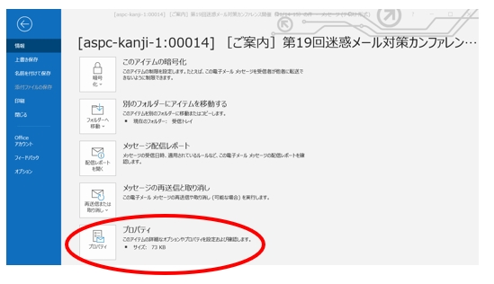
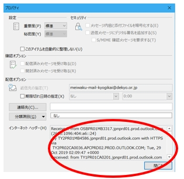
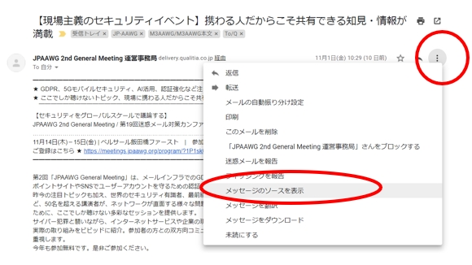
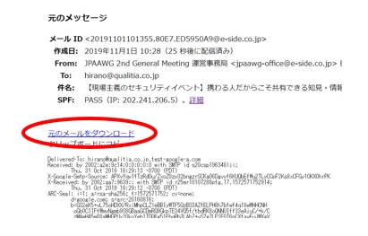
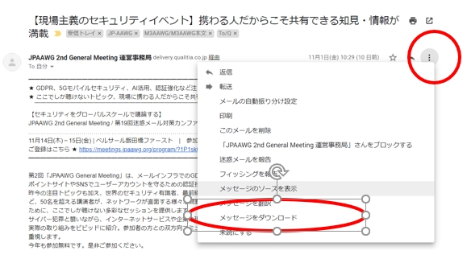
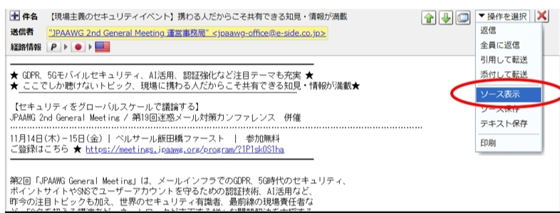
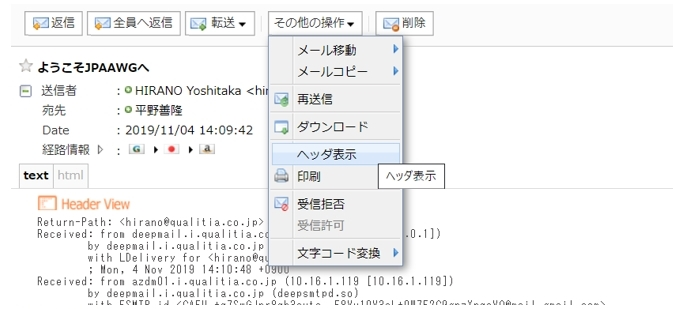
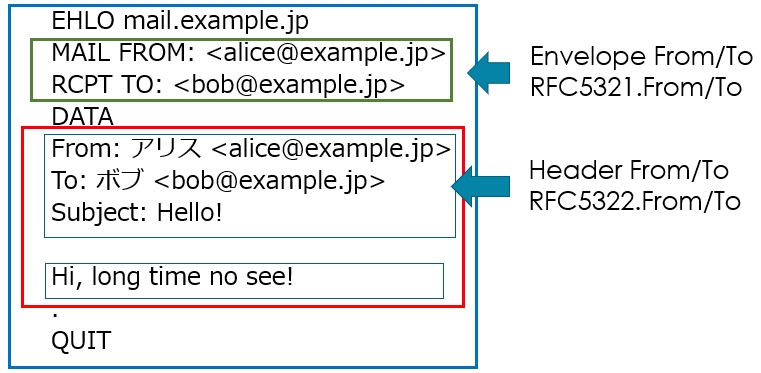
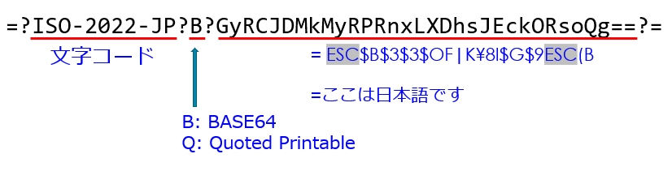
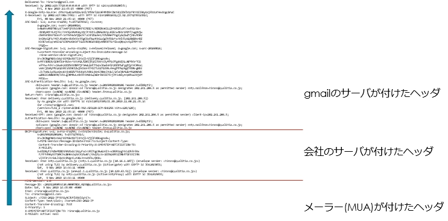

# メールソースの読み方 (ヘッダ編)

## はじめに

メールソースの特にヘッダ部分について、なるべくセキュリティ的な観点で解説します。
リファレンス形式ではなく読み物形式になっていますので、長ったらしいところもあるかと思いますが、ゆったりとお付き合いください。
また、随時RFCへのリンクを載せていますので、より詳しく知りたい方はそちらもあわせてご覧ください。

## メールソースの確認方法

そもそも、メールソースやヘッダをどうやったら見ることができるのでしょうか。
いくつかのメールソフトについて、その方法を説明していきます。

### Outlookの場合

1. ソースを見たいメールをメール一覧からダブルクリックして別ウィンドウで開きます。
2. ファイルメニューをクリックします。



3. プロパティを選択します。



下の方にインターネットヘッダーというのがあります。
これが、メールソースのヘッダ部分です。
残念ながら、OUtlookではメールソース全体を見ることはできないのですが、ヘッダについては表示することができます。

### Gmailの場合

1. 一覧をクリックしてメールを開きます。
2. メールの右上の「縦の･･･」をクリックしてメニューを表示します。



3. 「メッセージのソースを表示」をクリックします。



「元のメッセージ」という画面が開き、メールのヘッダを見ることができます。
ただし、ここで表示されるヘッダはわかりやすいように変換されている場合がありますので、本当の生データを見たい場合には、「元メールをダウンロード」をクリックしてメールをダウンロードします。



メールのダウンロードはメニューから直接おこなうことも可能です。

### Active! mailの場合

1. 一覧をクリックしてメールを開きます。



2. 「操作を選択」メニューから、「ソース表示」を選択します。

「ソース保存」で直接ダウンロードすることも可能です。


### DEEP Mailの場合

1. 一覧をクリックしてメールを開きます。



2. 「その他の操作」メニューから「ヘッダの表示」を選択します。

「ダウンロード」で直接ダウンロードすることも可能です。


## メール配送の流れ

メールソースの話に入る前に、メールの配送の仕組みについておさらいしておきたいと思います。

メールはSMTPというプロトコルを通して配送されます。

SMTPは1980年代から使われているプロトコルで、1982年に[RFC821](https://tools.ietf.org/rfc/rfc821.txt)で定義されて以降、[RFC2821](https://tools.ietf.org/rfc/rfc2821.txt)(2001年)、[RFC5321](https://tools.ietf.org/rfc/rfc5321.txt)(2008年)と改良されていますが、基本的な流れは変わっていません。

いくつかのコマンドを介して情報を受信側に伝える仕組みで、その中のDATAというコマンドで渡されるデータが今回取り扱うメールソースにあたります。

<!-- 絵にしてもらうのがいいかも -->
```
送信者側                                受信者側
   |   接続                                |
   +-------------------------------------->|
   |                                       |
   |   220 receiver.example.com .....      |
   |<--------------------------------------+
   |                                       |
   |   EHLO sender.example.jp              |
   +-------------------------------------->|
   |                                       |
   |   250-receiver.example.com            |
   |   250-8BITMIME                        |
   |   250 STARTTLS                        |
   |<--------------------------------------+
   |                                       |
   |   MAIL FROM: hirano@example.jp        |
   +-------------------------------------->|
   |                                       |
   |   250 2.1.0 Ok                        |
   |<--------------------------------------+
   |                                       |
   |   RCPT TO: tanaka@exmple.com          |
   +-------------------------------------->|
   |                                       |
   |   250 2.1.5 OK                        |
   |<--------------------------------------+
   |                                       |
   |   DATA                                |
   +-------------------------------------->|
   |                                       |
   |   354 End data with <CR><LF>.<CR><LF> |
   |<--------------------------------------+
   |                                       |
   |   メールソースの送信                    |
   +-------------------------------------->|
   |                                       |
   |   . (ピリオド)                         |
   +-------------------------------------->|
   |                                       |
   |   250 2.0.0 Ok: queued as ...         |
   |<--------------------------------------+
```

メールが送られるとき、裏では、送信側のメールサーバと受信側のメールサーバの間で図のようなやりとりがおこなわれています。
詳細についてはここでは省略しますが、送信サーバは、

- 送信サーバの名前
- 送信者のメールアドレス
- 受信者のメールアドレス
- メール本体

の情報を受信サーバに送ります。

このメールアドレスはあくまで配送の過程で使用されるもので、みなさんのメールソフトで見えている送信者、受信者とは必ずしも一致しません。

### 2種類のFrom To

上で説明した送信者、受信者のメールアドレスは、メールサーバがメールをやりとりする上で、誰から来たのか、誰に届けたらいいのかを知る上で必要となるメールアドレスです。
これは、一般的にEnvelope(エンベロープ) Fromや、Envelope Toと呼ばれますが、RFC5321で定義されている内容なので、RFC5321.From、RFC5321.Toや、古い文献では、RFC821.From、RFC821.Toなどと呼ばれることもあります。

普段メールソフトで目にする送信者、受信者は、DATAで送信されるメール本体の中のヘッダ情報に書かれています。
メールヘッダに書かれている内容なので、Header(ヘッダ)From、Header Toと呼ばれます。

こちらも、RFC5321.From/Toと同様に、RFC5322で定義されていますので、RFC5322.From、RFC5322.Toや、古い文献ではRFC822.From、RFC822.Toと呼ばれることもあります。

他に宛先を表すヘッダとしてCcもありますが、Header Toと全く同じものと考えて問題ありません。



青線で囲った部分はSMTPの範囲を表しています。
こちらは[RFC5321](https://tools.ietf.org/rfc/rfc5321.txt)で詳しく定義されています。

赤線で囲った部分はメール本体、いわゆるeml形式と呼ばれる部分で、[RFC5322](https://tools.ietf.org/rfc/rfc5322.txt)で、詳しく定義されています。

それぞれのFrom/Toについて簡単にまとめてみると、次のようになります。

#### Envelope From

    メール配送段階での送信者のメールアドレスです。
    受信サーバーはこのアドレスを利用して配送元を判断します。
    SPFフィルタで利用されるのもこのアドレスです。
    メールを配送できない場合のエラーメールの配送先としても利用されます。

#### Envelope To

    実際にメールを配送する宛先です。
    ToやCcに自分のアドレスが書かれていないのに、メーリングリストやいわゆるBccのメールがとどくのは、このアドレスにあなたのメールアドレスが指定されているからです。

#### ヘッダ From

    メールソフトで表示される送信者のメールアドレスです。
    メールアドレスのほか、ディプレイ名なども含まれます。
    メールソフトで返信する場合、特に指定がなければ、通常このアドレスが返信先のアドレスになります。

#### ヘッダ To/Cc

    メールソフトで表示される受信者のアドレスです。
    メールアドレスのほか、ディプレイ名なども含まれます。


今回はヘッダの解説ですので、これ以降の説明では、From/Toは特に断りのない限り、ヘッダFrom/Toを指しているものとして扱います。

## 基本的なヘッダ

よく見かける基本的なヘッダについて説明します。

### 簡単なヘッダの構造

まず、シンプルなメールソースを見てみましょう。

```header
MIME-Version: 1.0
Message-ID: <20191114150001.00002D14.0756@qualitia.co.jp>
Date: Thu, 14 Nov 2019 15:00:01 +0900
From: HIRANO Yoshitaka <hirano@qualitia.co.jp>
To: <customer@example.jp>
Cc: <co-worker@qualitia.co.jp>
Bcc: <boss@qualitia.co.jp>
Subject: test
Content-Type: text/plain; charset=US-ASCII
Content-Transfer-Encoding: 7bit
X-Priority: 3
X-MAILER: Active! mail

test
```

これは、あるメールソフトからメールを送信し、「送信済み」ボックスにあったものを確認したという想定です。
送信サーバや受信サーバがヘッダを追加する前のものですので、非常にシンプルでわかりやすい内容になっています。

ちなみに、最小限必要なヘッダはDateとFromのみで、他のヘッダは必須ではありません。

ヘッダの構造には、次のような特徴があります。

- 「ヘッダ名: 内容」で表現されている
- 1つのヘッダは1行で表されている

複数行にまたがる場合もあるのですが、それは表現方法の問題で、実質的には1行ですので、ここでは1行として理解することにします。

では、上から1行ずつ順番に解説していきます。

### MIME-Version ([RFC2045 §4](https://tools.ietf.org/html/rfc2045#section-4))

```
MIME-Version: 1.0
```

私が若かった頃、メールには添付ファイルというものがありませんでした。
ファイルを送信するためには、ファイルをuuencodeという特殊なエンコードでアルファベットなどの文字列に変換し、本文にbeginとendで囲んで貼り付けていました。

また、日本語の扱いもあいまいで、7bitしか通らない環境があるため、アルファベットやISO-2022-JPやJIS X0208の文字コードしか扱えませんでした。
メールソフトの対応もまちまちで、件名には英語かローマ字を使いましょう、というネチケット(死語)も長い間存在しました。

その後、このような問題を解決するために、MIMEという形式が登場しました。
MIMEを利用すると次のようなことが可能になります。

- メールにファイルを添付する
- ヘッダや本文に日本語などASCII以外の文字を使用する
- Content-○○というヘッダを使用する

Content-○○ヘッダについては、後で詳しく説明します。

MIME-Versionヘッダには、MIME形式のバージョンが記述されます。
1996年に[RFC2045](https://tools.ietf.org/rfc/rfc2045.txt)として登場して以降、2020年5月現在、このバージョンは今でも1.0です。

### Message-ID ([RFC5322 §3.6.4](https://tools.ietf.org/html/rfc5322#section-3.6.4))

```
Message-ID: <20191114150001.00002D14.0756@qualitia.co.jp>
```
このメールを特定するための、世界で唯一のIDです。

通常「<○○@○○>」の形式になります。

@より後ろの部分に自分のドメインやメールサーバーのFQDNなホスト名を使用することが推奨されています。
そうすることで@の前の部分を自分のドメインやホストの範囲内で確実にユニークになるようにすることさえできれば、世界で唯一のMessage-IDを実現することができます。

ただし、世界で唯一のIDではあるのですが、Message-IDをメールのユニークなIDとして実際に利用することには注意が必要です。

例えば、件名を書き換えるようなメーリングリストでは、書き換え前と書き換え後で同じMessage-IDですが、同じメールであるとは言えません。

受信者ごとにバラバラに配送するメールサーバや、一部の受信者への配送がリトライされた場合なども、同じMessage-IDであってもReceivedヘッダなどの一部が異ります。

@の後ろの部分に自分のパソコンのホスト名を付けるメールソフトが存在したこともあります。
この場合もパソコンのホスト名はパソコンの所有者が好きなように付けているので、ユニークにはなりません。

### Date ([RFC5322 §3.6.1](https://tools.ietf.org/html/rfc5322#section-3.6.1))
```
Date: Thu, 14 Nov 2019 15:00:01 +0900
```

メールが作成された日時です。
このヘッダは必須で、必ず書く必要があります。

通常メールソフトが付けますが、メールソフトが付けなかった場合は、配送するメールサーバが付ける場合もあります。
メールソフトが付ける場合はパソコンの日時になるので、パソコンの日時がずれていると実際に送られた日時とは異なってしまいます。

私が若かった頃は、メール一覧を表示する時、このDateヘッダを元に新しい順にソートして表示する環境もあったので、スパマーは一覧の上の方に表示されるようにするために、よく未来の日付を設定して送信していました。

最近では、メール一覧は受信側のサーバがメールを受信した日時で表示されることがほとんどです。
もし、メール一覧にある日時とメール詳細表示にある日時が異なっていたら、それはメール一覧にはサーバでの受信日時、詳細表示にはDateヘッダの値が表示されていると考えていいでしょう。


さて、Dateヘッダの形式ですが、[RFC5322 §3.3](https://tools.ietf.org/html/rfc5322#section-3.3)で次のように決められています。

    曜日, 日 月 年 時:分:秒 タイムゾーン

曜日は、Mon, Tue, ...の3文字の形式、月はJan, Feb, ...の同じく3文字の形式になります。
年は4桁以上、日は1桁または2桁、時分秒は2桁の数字です。
1時2分3秒は必ず01:02:03ですが、4日は4の場合も04の場合もあり得るので注意が必要です。
また、空白も1つとは限らないので、スペース + 4となっているものも見かけます。

項目のすべてが必須というわけではなく、曜日と秒は省略可能です。

タイムゾーンは必須で+0900、-0100のように「+」または「-」と4桁の数字になります。

後ろに(JST)のようにタイムゾーンの名前が付いている場合もありますが、これは、後で解説しますが、ただのコメントです。

### From ([RFC5322 §3.6.2](https://tools.ietf.org/html/rfc5322#section-3.6.2))
```
From: HIRANO Yoshitaka <hirano@qualitia.co.jp>
```

メールの送信者です。
RFCどおりの表現をすると、メールの内容に責任を持つ著者のメールアドレス、です。
実は、送信者というよりは、作成者という方が正しい表現なんですね。

まぁ、シンプルです。
でも、念のため、原文を見てみましょう。

> The "From:" field specifies the author(s) of the message, that is, the mailbox(es) of the person(s) or system(s) responsible for the writing of the message.


おっと。複数形があちこちら見られます。

そうなんです。実はFromヘッダには複数のメールアドレスを書くことができるのです。
もし、複数のメールアドレスをFromヘッダに記述した場合は、作成者と送信者が同じではありませんので、送信者を表すSenderヘッダを書かなければいけません。

私が若かった頃は、Fromヘッダに学校のメールアドレスと自宅のメールアドレスの両方を書いている人もいましたが、最近はほどんど見かけることはなくなりました。

FromヘッダとEnvelope Fromは同じである必要はありません。
あくまで、Fromヘッダはメールの作成者、Envelope Fromはメールの送信元という位置づけです。

Fromヘッダは必須で、必ず書く必要があります。

### To ([RFC5322 §3.6.3](https://tools.ietf.org/html/rfc5322#section-3.6.3))
```
To: <customer@qualitia.co.jp>
```

メールの送信先です。

1つの宛先でも構いませんし、複数の宛先を記述しても構いません。
また、Toヘッダ自体がなくても構いません。

ただし、Toヘッダ自体をを複数書くことは、今は間違いです。

### Cc ([RFC5322 §3.6.3](https://tools.ietf.org/html/rfc5322#section-3.6.3))
```
Cc: <co-worker@qualitia.co.jp>
```

メールの送信先です。

メールが送られる先として、技術的にはToと全く何も変わりません。

Toが直接の宛先であるのに対して、Ccは直接の宛先ではない、という意思表示の違いのみです。
Toは「あなた宛に書きましたよ」という場合に使い、Ccは「Toの人に書いたので、見ておいてくださいね」というような場合に使います。

今回、お客様宛であるcustomer@example.jp宛にメールを送信しましたが、この時、同僚のco-worker@qualitia.co.jpさんにもやりとりを見ておいて欲しかったので、Ccに入れました。

CcはCarbon Copyの略で、タイプライターでカーボン紙を敷いて文書のコピーを作成していたことに由来します。

つまり、Toは原本の送り先、Ccはそのコピーの送り先といったところでしょうか。

### Bcc ([RFC5322 §3.6.3](https://tools.ietf.org/html/rfc5322#section-3.6.3))
```
Bcc: <boss@qualitia.co.jp>
```

受信者には見えないメールの送信先です。
BccはBlind Carbon Copyの略です。

これも、技術的には配送先としてToやCcと全く何も変わりません。

ただし、システムは送信時にBccヘッダを削除したり、メールを配送先毎に1つずつコピーして、その宛先のアドレスのみのBccヘッダに書き換えたりします。
やり方はシステムによって様々ですが、いずれも、メールの受信者には他のBccの宛先が誰なのかはわからないようになっています。

### メールアドレスの形式 ([RFC5322 §3.4](https://tools.ietf.org/html/rfc5322#section-3.4))

ToやCc、Bccなどで記述されるメールアドレスの形式には次のようなものがあります。

- `hirano@qualitia.co.jp`
- `<hirano@qualitia.co.jp>`
- `HIRANO <hirano@qualitia.co.jp>`

この中で、HIRANOの部分はディスプレイネームと呼ばれます。
メールソフトによってはこの部分のみしか表示しないものがあるため、メールアドレスの詐称に気づかないような問題がしばしば発生します。

例えば、次のようなヘッダはあなたのメールソフトではどのように表示されているでしょうか。

```
From: "HIRANO" <badguy@ayashii.example.jp>
```

HIRANOさんから届いたように見えてしまわないでしょうか。

こういうものもありえます。badguy@ayashii.example.jpさんがhirano@qualitia.co.jpになりすまそうとしているケースです。

```
From: "hirano@qualitia.co.jp" <badguy@ayashii.example.jp>
```

DKIMやDMARCはayashii.example.jpの部分使って検証します。
このメールが「正しく」ayashii.example.jpとして送信されているのであればDKIMもDMARCもPASSして、このメールの送信ドメイン認証は正しいと判断されます。

あなたのメールソフトでは、hirano@qualitia.co.jpさんから届いたように見えるのでしょうか、それとも、badguyさんから届いたように見えるのでしょうか。


### Subject ([RFC5322 §3.6.6](https://tools.ietf.org/html/rfc5322#section-3.6.6))
```
Subject: test
```

件名です。

返信の時には、元の件名の前に「Re: 」を付けることもあります。
Reとはいったい何の略なのでしょうか。
実は、これは、ReplyやResponseの略ではないんです。
ラテン語の「in re」の略で、意味は、「~に関して」です。

と、RFCに書いてあります。

また、Re:は1つだけ付けるべきで、「Re: Re: Re: Re: ...」となるのはRFC的にはよくないそうです。

### Content-Type ([RFC2045 §5](https://tools.ietf.org/html/rfc2045#section-5))
```
Content-Type: text/plain; charset=US-ASCII
```

Content-TypeはBodyがどんな形式であるかを表します。
上記の例では、本文の形式が、プレインテキストで、文字コードがUS-ASCIIであることを表しています。

text/plainの部分は、それぞれ、メディアタイプやMIME Type、MIME SubTypeなどと呼ばれます。

MIME Typeには本文の形式を表すものとしてtextのほか、image、 audio、 video、 applicationなどがあります。
そのほか、マルチパートなどの構造を表すものとして、messageやmultipartなどが存在します。

Content-Typeヘッダを書かなかった場合、デフォルトは、
```
Content-Type: text/plain; charset=US-ASCII
```
として扱われます。

### Content-Transfer-Encoding ([RFC2045 §6](https://tools.ietf.org/html/rfc2045#section-6))
```
Content-Transfer-Encoding: 7bit
```

Content-Transfer-EncodingヘッダはBodyのEncoding形式を表します。

値は、7bit、8bit、base64、quoted-printableなどが存在します。
大文字小文字は区別されません。

Content-Transfer-Encodingヘッダを書かなかった場合のデフォルトは、
```
Content-Transfer-Encoding: 7BIT
```
になります。

8bitは、SMTPのEHLOで応答したメールサーバが8BITMIMEに対応していると返した場合のみ使用できます。
8bitの利用率はあまり高くなく、日本ではiso-2022-jpではなくUTF-8で送る場合もにbase64が多く利用されています。

base64、quoted-printableについては、あとで詳しく説明します。

## RFCに載っていないヘッダ

### X-Priority
```
X-Priority: 3
```
優先度や重要度が記述されます。
1が最も優先度や重要度が高く、5が最も低くなります。

「X-」から始まるヘッダは自由に定義できるもので、RFCにはX-Priorityについての説明はありません。[RFC6758](https://tools.ietf.org/html/rfc6758#section-1)にはX-Priorityはドキュメント化されていないと書かれています。

RFCには定義されていないのですが、非常によく使われています。

RFCに定義されているものとしては、Priority、Importanceというヘッダがあります。
これらは[RFC2156](https://tools.ietf.org/html/rfc2156)で定義されています。

他にRFCに定義はされていないがよく見かけるものとしては、X-MSMail-Priorityというものもあります。

### X-Mailer
```
X-MAILER: Active! mail
```

メールソフトの名前やバージョンが記述されます。
これも、RFCでは定義されていませんが、よく見かける項目です。

## 本文

ヘッダの後、改行のみの行が一行入り、その後がメールの本文となります。

本文がBase64やQuoted-Printableでエンコードされている場合は、Content-Transfer-Encodingヘッダにエンコード方式が記述されます。

本文のタイプはContent-Typeヘッダに記述されます。
テキストの場合は文字コードの種類もContent-Typeヘッダに記述されています。

## 少し複雑なヘッダ構造

ここまで、最も基本的なヘッダの種類について紹介してきました。
ヘッダの形式には慣れてきたと思いますので、少しだけ複雑なヘッダの書き方についてご紹介します。

### ヘッダの折り返し ([RFC5322 §2.2.3](https://tools.ietf.org/html/rfc5322#section-2.2.3))

1つのヘッダは1行で表すと書きましたが、1行で表せない場合があります。

まず、[RFC5321 §4.5.3.1.6](https://tools.ietf.org/html/rfc5321#section-4.5.3.1.6)によると、SMTPの1行の上限が改行コードの(CR/LF)を含んで1000オクテットと決まっています。
1オクテットは1バイト、つまり、通常のASCII文字の1文字です。
改行コードを含んで1000文字なので、実質998文字が上限ということになります。

また、より保守的な観点では、メールソフトに勝手に折り返されたり、後ろをちょん切られたりしないように、78文字以下が望ましいとされています。([RFC5322 §2.1.1](https://tools.ietf.org/html/rfc5322#section-2.1.1))

このような理由から、ヘッダが長い場合には折り返す仕組みが必要になります。

#### ヘッダの折り返しルール ([RFC5322 §3.2.2](https://tools.ietf.org/html/rfc5322#section-3.2.2))

- 2行目以降の行をスペースまたはTABで始めます
- 改行 + スペースやタブ(の連続)は、すべて合わせて1つのスペースとみなされます

つまり、
```
Subject: This is a
 very long subject
```
は、
```
Subject: This is a very long subject
```
のように解釈されます。

スペースやタブはいくつ書いても構いませんので、

```
Subject: This is a
         very long
         subject
```
も同様に、
```
Subject: This is a very long subject
```
のように解釈されます。

ごくまれに、
```
Subject:
 This is a subject
```
や
```
Subject: This is a subject
 ← ここにスペースがある
To: alice@example.jp
```
のようなものも見かけますが、間違いではありません。
Toの部分を本文だと解釈してしまわないように気をつけましょう。

### 日本語の扱い

#### 7bitの文字コードを使用する

MIMEがない時代から使われている方法です。

<!-- 「<ESC>$B$3$3$OF|K\8l$G$9<ESC>(B」に色付けてください -->
```
Message-ID: <20191114150001.00002D14.0756@qualitia.co.jp>
Date: Thu, 14 Nov 2019 15:00:01 +0900
From: HIRANO Yoshitaka <hirano@qualitia.co.jp>
To: <hirano@qualitia.co.jp>
Subject: <ESC>$B$3$3$OF|K\8l$G$9<ESC>(B

<ESC>$B$3$3$OF|K\8l$G$9<ESC>(B
```

「`<ESC>`$B$3$3$OF|K\8l$G$9`<ESC>`(B」の部分は「ここは日本語です」をiso-2022-jpの文字コードで表現したものです。
`<ESC>`は文字コード*0x1b*のエスケープシーケンスです。
`<ESC>$B`で日本語が始まり、`<ESC>(B`で日本語が終わります。

ここで使われている文字は、すべて、7bitの範囲なので、特殊なエンコーディング使用しなくてもそのまま使用できます。

#### MIMEエンコードを使用する

現在はMIMEの時代なので、Subjectや本文の文字コードをシステムに類推させるような上記の方法はよくありません。
MIMEを使用して、きちんとiso-2022-jpを使用していることを明示してみましょう。


<!--「=?ISO-2022-JP?B?GyRCJDMkMyRPRnxLXDhsJEckORsoQg==?=」と「charset=iso-2022-jp」に色を付けてください -->
```
MIME-Version: 1.0
Message-ID: <20191114150001.00002D14.0756@qualitia.co.jp>
Date: Thu, 14 Nov 2019 15:00:01 +0900
From: HIRANO Yoshitaka <hirano@qualitia.co.jp>
To: <hirano@qualitia.co.jp>
Subject: =?ISO-2022-JP?B?GyRCJDMkMyRPRnxLXDhsJEckORsoQg==?=
Content-Type: text/plain; charset=iso-2022-jp
Content-Transfer-Encoding: 7bit

<ESC>$B$3$3$OF|K\8l$G$9<ESC>(B
```

Content-Typeヘッダのcharsetで、本文の文字コードがiso-2022-jpであることが明示されました。

また、Subjectのところが、「=?ISO-2022-JP?B?GyRCJDMkMyRPRnxLXDhsJEckORsoQg==?=」になりました。



MIMEエンコードは、「=?」からはじまり「?=」で終わります。

`=?<文字コード>?<エンコード方式>?<エンコードされた内容>?=`のように表現されます。

先ほどの例の場合、文字コードがISO-2022-JP、エンコード方式がBase64、エンコードされた内容が「GyRCJDMkMyRPRnxLXDhsJEckORsoQg==」であることを表します。

「GyRCJDMkMyRPRnxLXDhsJEckORsoQg==」はBase64にエンコードされた文字列ですので、これを元に戻すと、「`<ESC>`$B$3$3$OF|K\8l$G$9`<ESC>`(B」になります。
これは、先ほどのものと同じで、「ここは日本語です」をiso-2022-jpで表現したものです。

##### BASE64

ここで、Base64について簡単に説明しておきます。

「あいう」というUTF-8で表現された文字をBase64にエンコードすることを考えてみます。

まず、「あいう」をUTF-8の文字コードに分解します。

```
E3 81 82  E3 81 84  E3 81 86
```

16進数で表現しましたので、2進数に変換します。
Eは1110、3は0011というふうに分解していきます。

```
11100011 10000001 10000010 11000011 10000001 10000100 11100011 10000001 10000110
```

1バイト(=8ビット)で区切られているので、これを6ビット毎に区切りなおします。

```
111000 111000 000110 000010 110000 111000 000110 000100 111000 111000 000110 000110
```

6ビットの区切りで16進数に変換します。

```
38 38 06 02 30 38 06 04 38 38 06 06
```

10進数に変換します。

```
56 56 6 2 48 56 6 4 56 56 6 6
```

6ビット毎で区切ったので、それぞれは0～63までの範囲に収まるはずです。
つまり64進数になっているのでBase64と呼ばれます。

できあがった、0～63の値を次の表に従って変換します。

```
     Value Encoding  Value Encoding  Value Encoding  Value Encoding
         0 A            17 R            34 i            51 z
         1 B            18 S            35 j            52 0
         2 C            19 T            36 k            53 1
         3 D            20 U            37 l            54 2
         4 E            21 V            38 m            55 3
         5 F            22 W            39 n            56 4
         6 G            23 X            40 o            57 5
         7 H            24 Y            41 p            58 6
         8 I            25 Z            42 q            59 7
         9 J            26 a            43 r            60 8
        10 K            27 b            44 s            61 9
        11 L            28 c            45 t            62 +
        12 M            29 d            46 u            63 /
        13 N            30 e            47 v
        14 O            31 f            48 w         (pad) =
        15 P            32 g            49 x
        16 Q            33 h            50 y
```

56 → 4、6 → Gのように変換していくと、

```
44GCw4GE44GG
```

となりました。
今回は大丈夫ですが、文字数が4の倍数にならないときは、4の倍数になるように後ろに「=」を必要な個数追加します。

これをMIMEエンコードで表すと、元がUTF-8ですので、

```
=?UTF-8?B?44GCw4GE44GG?=
```
となります。

元の文章「あいう」はUTF-8で9バイトでした。
Base64後のコードは「44GCw4GE44GG」で12バイトになりました。
8bitを6bitにしていますので、サイズは元のコードの4/3倍になります。

##### Quoted-Printableエンコード

MIMEエンコードには、Base64の他にQuoted-Printableという形式があります。

Quoted-Printableは表示(プリント)できないような文字を「=」+「16進数のコード」に変換して表現する形式です。

さっきの、「あいう」をUTF-8で表現したものであれば、

「あいう」のUTF-8コードは、
```
E3 81 82 E3 81 84 E3 81 86
```
なので、
```
=E3=81=82=E3=81=84=E3=81=86
```
となります。

元のデータは9バイト、Base64は12バイトでしたので、Base64と比べても27バイトと、かなり長くなってしまいました。

しかし、プリントできる文字はそのまま使用できますので、文字コードiso-8859-1で書かれた、

```
Je suis français.
```
という文章は、
```
Je suis fran=E7ais.
```
と表現できます。
この場合には、元の文章に比べて2バイト増えるだけですみます。

MIMEエンコード形式にすると、
```
=?ISO-8859-1?Q?Je suis fran=E7ais.?=
```
となります。

このように、変換後のサイズからか、欧米ではQuoted-Printableが、アジア圏ではBase64が好まれることが多いようです。

#### 本文にもMIMEエンコードを使用する

件名および本文に「ここは日本語です」というのをUTF-8で書いた例です。

<!-- 「=?UTF-8?B?44GT44GT44Gv5pel5pys6Kqe44Gn44GZ44CC?=」と「44GT44GT44Gv5pel5pys6Kqe44Gn44GZ44CCDQo=」「base64」に色を付けてください -->
```
MIME-Version: 1.0
Message-ID: <20191114150001.00002D14.0756@qualitia.co.jp>
Date: Thu, 14 Nov 2019 15:00:01 +0900
From: HIRANO Yoshitaka <hirano@qualitia.co.jp>
To: <hirano@qualitia.co.jp>
Subject: =?UTF-8?B?44GT44GT44Gv5pel5pys6Kqe44Gn44GZ44CC?=
Content-Type: text/plain; charset="UTF-8"
Content-Transfer-Encoding: base64

44GT44GT44Gv5pel5pys6Kqe44Gn44GZ44CCDQo=
```

Content-Transfer-Encodingヘッダが7bitではなくbase64になっています。
日本語を含む本文をUTF-8で送信する場合、UTF-8では8bit部分を含みますので、7bitでは送ることができず、base64を使用するのが一般的です。

件名も本文も同じ「ここは日本語です」なのですが、後ろの部分が少し異なっています。
本文の方が後ろに「DQo=」が追加されているようです。

「DQo=」をbase64から元のデータに変換してみましょう。

先ほどの表から、「DQo=」は、

```
3 16 40 pad
```
です。

16進数にすると、
```
03 10 28 pad
```
さらに2進数にして、
```
00000011 00010000 00101000 pad
```
上位2bitを削って6bitにします。
```
000011 010000 101000 pad
```
8bit毎に区切り直します。
```
00001101 00001010 00pad
```
paddingの部分は捨てて16進数に変換します
```
0D 0A
```

はい。CR/LFの改行ですね。

Base64では元の本文の改行も含んでエンコードします。
つまり、Base64中に現れる改行はデコード後の本文には影響しません。

### コメント

ヘッダ中のコメントは()かっこで囲むことで表現できます。
構造化されたヘッダでは、いろいろなところにコメントを書くことができます。

RFCで「CFWS」と書かれてる部分には、すべてをコメントを書くことが許されています。
例えば、どんなところにコメントを書けるのでしょうか。

RFCでのメールアドレスの定義を見てみましょう。
```
addr-spec       =   local-part "@" domain
local-part      =   dot-atom / quoted-string / obs-local-part
domain          =   dot-atom / domain-literal / obs-domain
```

addr-specというのがメールアドレスです。
local-partやdomainはdot-atomで書けるようです。
では、dot-atomを見てみましょう。
```
dot-atom        =   [CFWS] dot-atom-text [CFWS]
dot-atom-text   =   1*atext *("." 1*atext)
```

CFWSが出てきました。

dot-atomだけに注目して、addr-specを展開すると、

```
addr-spec       = [CFWS] dot-atom-text [CFWS] "@" [CFWS] dot-atom-text [CFWS]
```

となります。
コメントを書けるところが見えてきました。

ということは、
```
From: (comment)<(comment)hirano(comment)@(comment)qualitia.co.jp(comment)>(comment)
```
は、正しいヘッダなのでしょうか。

はい。現在の[RFC5322](https://tools.ietf.org/html/rfc5322)ではヘッダとしては正しく、「`From: <hirano@qualitia.co.jp>`」と同じ内容です。

[RFC5322の付録A.5](https://tools.ietf.org/html/rfc5322#appendix-A.5)には次のような例も記載されています。
```
From: Pete(A nice \) chap) <pete(his account)@silly.test(his host)>
To:A Group(Some people)
     :Chris Jones <c@(Chris's host.)public.example>,
         joe@example.org,
  John <jdoe@one.test> (my dear friend); (the end of the group)
Cc:(Empty list)(start)Hidden recipients  :(nobody(that I know))  ;
Date: Thu,
      13
        Feb
          1969
      23:32
               -0330 (Newfoundland Time)
Message-ID:              <testabcd.1234@silly.test
Testing.
```

もはや、何が何やら・・・。

## 受信時のヘッダ

送信時にメールソフトが付ける基本的なヘッダについて説明してきました。

今度は、受信した側から見てみましょう。

次の画像はある会社からGmailに対してメールを送った場合の全ヘッダーです。



先ほどのシンプルな例から比べるとずいぶんたくさんのヘッダが追加されています。

メールは各メールサーバを経由してユーザーに届きますので、各サーバが様々なヘッダを追加します。
メールサーバによっては例外もありますが、基本的にはメールを受け取ったサーバはヘッダを一番上に追加しますので、ヘッダを下から上に向けて読むことでメールの流れを追いかけることができます。

上の画像の例では、まずメールソフトが基本的なヘッダを付けたうえで社内のメールサーバーに渡し、受け取った社内のメールサーバは更にいくつかのヘッダを追加しています。
そして、社内のメールサーバはGmailメールサーバに対して配送し、そのGmailのメールサーバはさらに様々なヘッダを追加したあと、受信者に届けています。

この章では、途中のメールサーバが付けるいくつかの重要なヘッダについて、特にメールセキュリティの観点から解説します。

### Received ([RFC5321 §4.4](https://tools.ietf.org/html/rfc5321#section-4.4))

Receivedヘッダはメールの配送経路を追いかけるうえで、非常に重要なヘッダです。
次の例は、社内にある2台のメールサーバを経由したときのようすです。

```
Received: from smtp.qualitia.co.jp (smtp.i.qualitia.co.jp [192.0.2.1])
        (envelope sender: <hirano@qualitia.co.jp>)
        (not using TLS) by delivery.qualitia.co.jp (Active!gate)
        with ESMTP id JOsL01507A;
        Sat,  9 Nov 2019 14:44:11 +0900
Received: from qualitia.co.jp (mailer.qualitia.co.jp [192.168.7.21])
        (envelope sender: <hirano@qualitia.co.jp>)
        (not using TLS) by smtp.qualitia.co.jp (Active!smtpProxy)
        with ESMTP id JOsL01507A;
        Sat,  9 Nov 2019 14:44:11 +0900
```

メールを受け取ったサーバは、Receivedヘッダを一番上に追加します。

Receivedヘッダの構成はおおざっぱには次のようになります。
```
Received: 様々な情報; 受信日時
```

受信日時はDateヘッダと同じ形式です。

様々な情報の部分の書式についてはRFC5322にはサンプルしか記述がなく[RFC5321](https://tools.ietf.org/html/rfc5321#section-4.4)で詳しく述べられています。

**from** EHLOやHELOの値 (接続元IPの逆引き [接続元IP])

**by** 自分のホスト名

SMTPの場合、この2つが必須です。
fromの()はここではコメントではありません。
そのほか、次のようなものが記述されることがあります。

**via** TCPなどのプロトコル名

**with** ESTPなどのプロトコル名

**id** メールサーバが処理するときのメールのID

**for** 配送先

上記の例の下側のReceivedヘッダからコメントをはずすと、次のようになります。
```
Received:
    from qualitia.co.jp① (mailer.qualitia.co.jp② [192.168.7.21③])
    by smtp.qualitia.co.jp④
    with ESMTP⑤
    id JOsL01507A⑥;
    Sat,  9 Nov 2019 14:44:11 +0900⑦
```

これは、2019年11月9日14:44:11⑦に、smtp.qualitia.co.jp④というメールサーバが、192.168.7.21③というIPアドレスからメールを受け取ってJOsL01507A⑥というIDで管理している、ということを意味します。
また、その時のIPアドレス192.168.7.21③の逆引きはmailer.qualitia.co.jp②で、使われたプロトコルはESMTP⑤であったこともわかります。

Receivedヘッダにはこのように、受け取ったサーバと、そこに送ったサーバの情報が書かれていますので、順番に下から読むと、どのメールサーバを経由してメールが到達したかを知ることができます。

例えば、1番下のReceivedヘッダのbyのドメイン(例えばA会社)と、下から2番目のReceivedヘッダのfromにあるドメインが全く異なっていれば、一番下のReceivedヘッダは悪意のある送信者が自分で書いたもので、A会社になりすまそうとしているのかも知れない、ということがわかります。

このように詐称された場合には、日時のところも通常のメール配送にかかる時間より間隔が長くなっているように見える場合もよくあります。

 ### DKIM-Signature ([RFC6376 §3.5](https://tools.ietf.org/html/rfc6376#section-3.5))

```
DKIM-Signature: v=1; a=rsa-sha256; c=simple/simple; d=qualitia.co.jp;
        s=20190928180106; t=1573278314;
        bh=JHJNgFNBisi6qhXiMGkdSSTI1Yajl+VjjlFd06xgsv8=;
        h=MIME-Version:Message-ID:Date:From:To:Subject:Content-Type:
         Content-Transfer-Encoding:X-Priority:X-MAILER;
        b=UlD8ytihVDePDDDiRHVXxGciXqyFvd+bFE7bgc0w6pml3+vd89RbagYrduD5frfHx
         F/FF5fH6yS3TG0KJsqNH6scWpVcX15wkF//UvQfp/o+1EO9qk85iZJNkRTGFA3IlRN
         vI3JJr/d+SoLlikd4cDVgcCucU6L3nsxRfBu/DHU=
```

メールが改ざんされていない、ということをはっきりさせるために、DKIM-Signatureというヘッダが付いていることがあります。

DKIM-Signatureヘッダは送信者や中間の配送サーバが一番上に追加します。

仕組みとしては、ヘッダや本文のハッシュ値を、公開鍵暗号方式で暗号化したものが記述されています。
つまり、ヘッダや本文に対して署名することで、改ざんされている場合には署名が合わなくなるのでわかる、という仕組みです。

検証する時は、公開鍵がDNSにありますので、それを用いてDKIM-Signatureヘッダの内容を復号し、ヘッダや本文のハッシュ値と一致するかどうかで確認することができます。

公開鍵のDNSは「s=」と「d=」の部分から、20190928180106._domainkey.qualitia.co.jpのtxtレコードにあることがわかります。

また、DKIM-Signatureヘッダは署名作成時に一番上に付けられますので、DKIM-Signatureヘッダより下の部分のみが署名の対象です。
DKIM-Signatureヘッダより上の部分はもし改ざんされていても評価ができませんので注意が必要です。

さらに、DKIM署名で重要なのが署名者なのです。
「d=」の部分にあるドメインが署名者になります。
ここでは、d=qualitia.co.jpですので、qualitia.co.jpが署名しているということになります。

このメールのFromヘッダもqualitia.co.jpである場合、自分ところで作成されたメールに対して自分で署名しているので、作成者署名と呼ばれたりします。

これに対して、例えば、Fromヘッダがqualitia.co.jpのメールに対してayashii.example.jpが署名した場合には、第三者署名と呼ばれます。

作成者署名の場合はDKIMの検査がPASSあれば改ざんはないと言えます。
第三者署名の場合には、署名された以降の経路での改ざんの有無は確認できますが、その第三者自身が改ざんしていないとは言い切れませんので、その第三者が信頼できるかどうかということも重要になります。

DKIM-Signatureヘッダが存在しない場合には、もちろん改ざんされているかどうかは判断できません。
しかし、普段からDKIM-Signatureが付いている送信者から、突然DKIM-Signatureがないメールが送られてきたらどうでしょうか。

普段から、ヘッダをよく観察しておくことで、いざという時に怪しいなりすましメールを見抜くことができるかも知れません。

例えば、実際にqualitia.co.jpは外部に送信するすべてのメールに対して、常にDKIM署名をしていますので、もし、qualitia.co.jpからDKIM-Signatureヘッダのないメールを受け取ったら、それは間違いなくなりすましメールだといえます。

### Authentication-Results ([RFC7601](https://tools.ietf.org/html/rfc7601))

```
Authentication-Results: mx.google.com;
       dkim=pass header.i=@qualitia.co.jp header.s=20150928180106 header.b=UlD8ytih;
       spf=pass (google.com: domain of hirano@qualitia.co.jp
       designates 202.241.206.5 as permitted sender)
       smtp.mailfrom=hirano@qualitia.co.jp;
       dmarc=pass (p=NONE sp=NONE dis=NONE) header.from=qualitia.co.jp
```

メールサーバによっては、受け取ったメールに対してAuthentication-Resultsヘッダを追加するものがあります。

Authentication-Resultsヘッダには、SPF、DKIM、DMARCなどの検証結果と誰が確認したかが書かれています。

上の例は、実際にqualitia.co.jpからGmailに対して送信したメールに対してGmailが付けたヘッダです。

まず、検証者はmx.google.comです。
Gmail上で確認したヘッダですので、改ざんされている可能性は非常に少なく、内容は信用してよいでしょう。

次に、「;」区切りで、dkim, spf, dmarcの検証結果がそれぞれ記述されています。

Authentication-Resultsヘッダ自体を信用できる場合は、DKIM署名などを自分で確認しなくても、この結果を見て判断することができます。

### Received-SPF ([RFC7208 §9.1](https://tools.ietf.org/html/rfc7208#section-9.1))

```
Received-SPF: pass (google.com: domain of hirano@qualitia.co.jp
       designates 202.241.206.5 as permitted sender) client-ip=202.241.206.5;
```

SPFの検証結果が書かれるヘッダです。

形式は次のようになります。

```
Received-SPF: 結果 (コメント) key=value; key=value; ...
```

コメントはIPや送信者、ドメインなどの情報です。
コメントなのですが、RFCには「SHOULD」で記載されていますので、書かれるべき項目です。

key=valueの部分は、後で機械で読めるようにするためのもので、keyには、client-ip、envelope-from、heloなどが存在します。

Authentication-ResultsヘッダにもSPFの検証結果があり、内容が重複するのですが、目的が少し異なっています。
Authenrication-ResultsヘッダがSPFの検証結果などをエンドユーザが利用できるようにすること目的にしているのに対して、Received-SPFヘッダはSPFを再評価するのに必要十分な情報を残すことも目的としています。

したがって、情報量としては、Authentication-Resultsの方がReceived-SPFに対して少なくなる可能性があります。

### Return-Path ([RFC5322 §3.6.7](https://tools.ietf.org/html/rfc5322#section-3.6.7))

Envelope Fromの情報が保存されています。

### Delivered-To

配送されるメールボックスのEnvelope Toの情報が保存されています。

RFCでの記述が見つけられませんでした。
ご存じの方がいたらぜひ教えてください。

## おわりに

メールのソース、特によく見かけるヘッダについて、基本的な部分とスパムやフィッシングを見抜くための手助けになるような情報を中心にご紹介しました。

マニアックな内容ですが、皆様の知識の肥やしになれば幸いです。

BODYパートについてや、スパムやフィッシングを見抜く方法についても、また、機会があれば解説したいと思いますので、感想や要望があれば、ぜひお知らせください。
